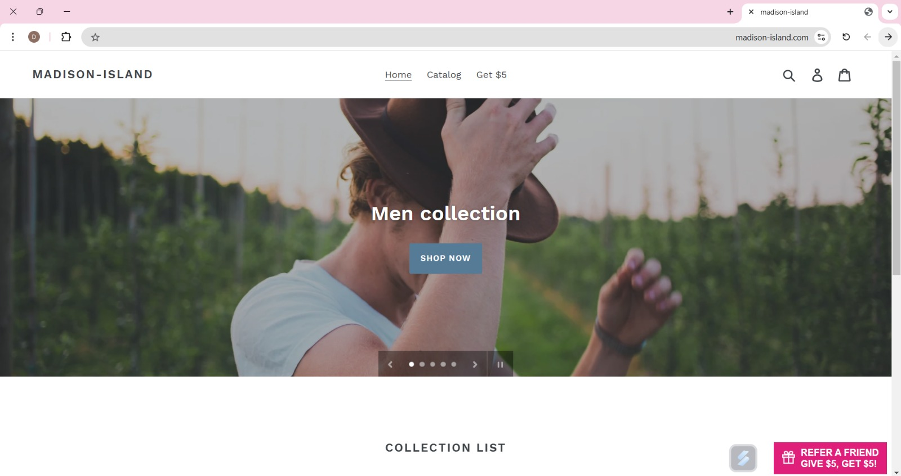

<!DOCTYPE html>
<html lang="en">
<head>
    <meta charset="UTF-8">
    <meta name="viewport" content="width=device-width, initial-scale=1.0">
    <title>Madison-Island Aautomation Project</title>
    
</head>
<body>
<h1> Madison-Island Aautomation Project</h1>
This is my first automation project with Java and Selenium, developed for shopping demo site: https://madison-island.com/  
<!--Further details can be found on the following website: __  -->

<h2> 🔍 Overview </h2>
I implemented the Page Object Model (POM) design pattern by organizing the project into 'Page' and 'Test' classes, where each web page is represented by its own corresponding class.  
Additionally, I designed the methods to be reusable and flexible, ensuring they can easily accommodate new features as the application evolves.  

<h2>💻 Technologies </h2>
☕<b>Java:</b> A versatile, object-oriented programming language known for portability and a vast ecosystem, ideal for web, mobile, and enterprise applications. 
💽<b>Selenium:</b> An open-source tool for automating web browsers, supporting multiple languages to test web applications. 
🧰<b>TestNG:</b> A Java testing framework offering features like parallel execution and data-driven testing for large-scale test automation. 
📊<b>Allure:</b> A test reporting framework that integrates with tools like TestNG to generate detailed, dynamic HTML reports. 
🛠️ <b>Maven:</b> A build automation tool for managing Java project dependencies, structure, and the build lifecycle. 
🌳<b>Git:</b> A distributed version control system for tracking code changes and enabling collaboration among developers. 
🤖<b>Jenkins:</b> An open-source automation server for continuous integration and delivery (CI/CD), supporting various tool integrations. 

<h2>📊 Reports </h2>

<!-- <h2>📖 User Guide </h2>
Please review this file: https://docs.google.com/document/d/1krdPGVB7Q1rza0lzCrx5gbg1yLOrP-CuVnI-RYg-5f0/edit?usp=sharing
 -->

<h2>📂 Project Structure</h2> 
├───.settings  
├───bin  
│   └───data  
│   ├───pages  
│   ├───tests  
│   └───utils  
├───src  
│   └───data  
│   ├───pages  
│   └───tests  
│   └───utils  
└───tests  
    └───tests  
└───utils  
    └───Utils  

<h2>👩🏽‍🦱 Contacts </h2>
Thanks for taking the time to explore my GitHub!
For any questions or feedback, feel free to contact me at: danielleamano01@gmail.com or 0502110677
</body>
